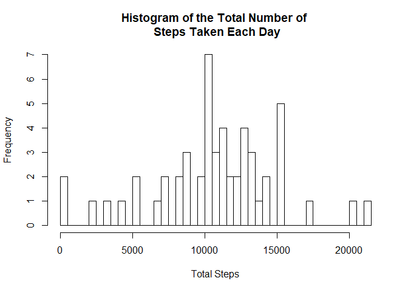
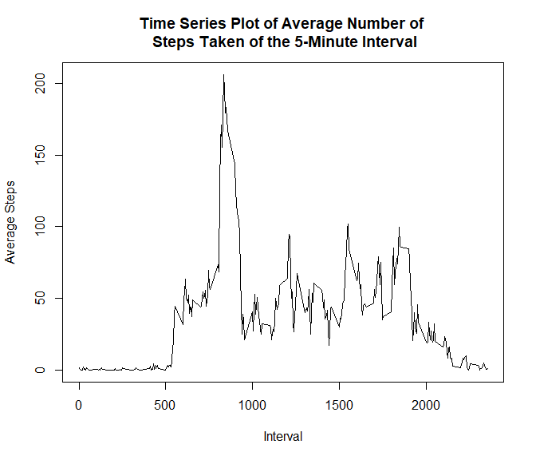
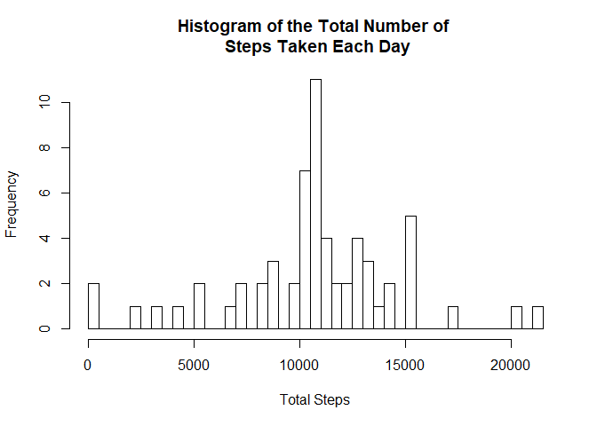
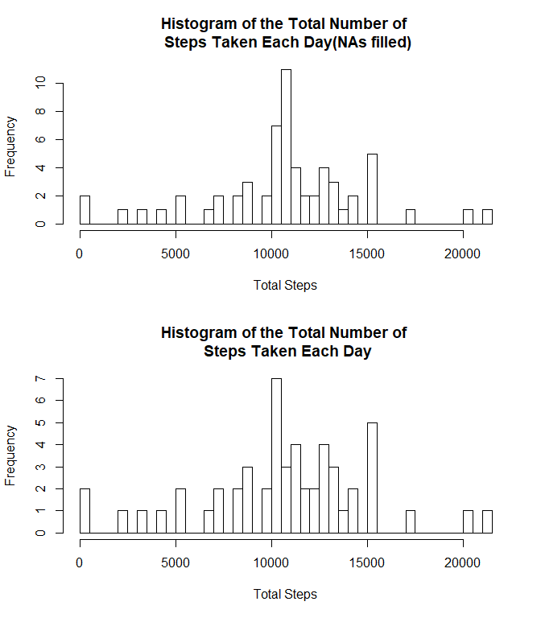
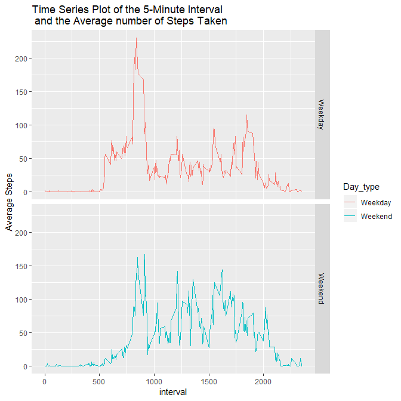

## Loading and preprocessing the data

```r
library(dplyr)
library(ggplot2)
data <- read.csv("activity.csv")
data_woNA <- na.omit(data)
```


## What is mean total number of steps taken per day?

```r
tot_step <- data_woNA %>% group_by(date) %>% summarise(Step_perday=sum(steps))
hist(tot_step$Step_perday, breaks=53, xlab="Total Steps", 
     main="Histogram of the Total Number of \n Steps Taken Each Day")
```

<!-- -->


```r
mean(tot_step$Step_perday)
```

```
## [1] 10766.19
```

```r
median(tot_step$Step_perday)
```

```
## [1] 10765
```


## What is the average daily activity pattern?

```r
avg_step <- data_woNA %>% group_by(interval) %>% 
        summarise(Avg_step_perday=mean(steps))
plot(avg_step$interval, avg_step$Avg_step_perday, type="l", 
     xlab="Interval", ylab="Average Steps", 
     main="Time Series Plot of Average Number of \n Steps Taken of the 5-Minute Interval")
```

<!-- -->


```r
avg_step[avg_step$Avg_step_perday==max(avg_step$Avg_step_perday), ]
```

```
## # A tibble: 1 x 2
##   interval Avg_step_perday
##      <int>           <dbl>
## 1      835            206.
```


## Imputing missing values

```r
# table(is.na(data$date))
# table(is.na(data$interval))
# NA's exist in variable of steps
nrow(filter(data, is.na(steps)==T))
```

```
## [1] 2304
```


```r
mean_by_interval <- data_woNA %>% group_by(interval) %>% 
        summarise(mean_steps_int = mean(steps))

Temp <- left_join(data, mean_by_interval, by="interval")
for (i in 1:nrow(Temp)) {
        if(is.na(Temp$steps[i])==T){
                Temp$steps[i]=Temp$mean_steps_int[i]
        }
        
}

data_fillNA <- Temp %>% select(-mean_steps_int)

step_perday <- data_fillNA %>% group_by(date) %>% summarise(Tot_Steps=sum(steps))
hist(step_perday$Tot_Steps, breaks=61, xlab="Total Steps", 
     main="Histogram of the Total Number of \n Steps Taken Each Day")
```

<!-- -->


```r
mean(step_perday$Tot_Steps)
```

```
## [1] 10766.19
```

```r
median(step_perday$Tot_Steps)
```

```
## [1] 10766.19
```


```r
par(mfrow=c(2, 1))
hist(step_perday$Tot_Steps, breaks=61, xlab="Total Steps", 
     main="Histogram of the Total Number of \n Steps Taken Each Day(NAs filled)")
hist(tot_step$Step_perday, breaks=53, xlab="Total Steps", 
     main="Histogram of the Total Number of \n Steps Taken Each Day")
```

<!-- -->

The result of mean and median total number of steps taken per day is pretty much the same as before. However, the histograms are slightly different. The data with NAs filled captures more observations of total number of steps around 10000. 


## Are there differences in activity patterns between weekdays and weekends?

```r
data_fillNA$date <- as.Date(data_fillNA$date)
data_fillNA_withDay <- data_fillNA %>% 
        mutate(Day=as.factor(weekdays(data_fillNA$date)))

data_fillNA_withDay$Day_type <- NA
for (i in 1:nrow(data_fillNA_withDay)) {
        if(data_fillNA_withDay$Day[i]=="Saturday" | data_fillNA_withDay$Day[i]=="Sunday"){
                data_fillNA_withDay$Day_type[i]="Weekend"
        }
        else{
               data_fillNA_withDay$Day_type[i]="Weekday"
        }

}
# table(data_fillNA_withDay$Day_type)

data_fillNA_withDay <- select(data_fillNA_withDay, -Day)

data_fillNA_withDay_int <- data_fillNA_withDay %>% group_by(interval, Day_type) %>% 
        summarise(Avg_steps=mean(steps))

ggplot(data_fillNA_withDay_int, aes(interval, Avg_steps, color=Day_type)) + 
        geom_line() + facet_grid(Day_type~.) + 
        labs(y="Average Steps", 
             title="Time Series Plot of the 5-Minute Interval \n and the Average number of Steps Taken")
```

<!-- -->


